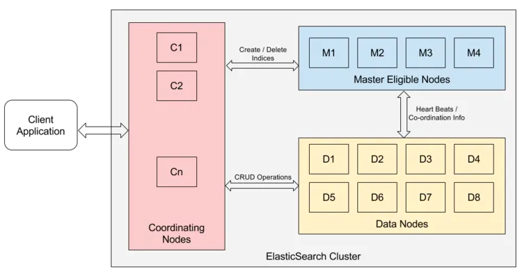

## elasticsearch integrated with python

### reference 
* [docker-es](https://github.com/BruskiCaleb/ES-Kibana-on-Docker/blob/main/docker-compose.yml)
* [es-py](https://github.com/elastic/elasticsearch-py)


### Elasticsearch basic concepts 

#### What's Elasticsearch?

ES is a combination of open-source, distributed, highly scalabel data store and Lucene- which is
a search engine that supports extremely fast full-text search. 

It is a beautifully crafted software, which hides the internal complexities and
provides full-text search capabilities with simple REST APIs. 

Elasticsearch is written in Java with Apache Lucene at its core.

It should be clear that Elasticsearch is not like a traditional RDBMS.

It is not suitable for your traditional database needs and hence, in my opinion, 
it should not be your primary data store. 

It is common practice to use a relational database as the primary data store 
and inject only required data into Elasticsearch. 

#### ES Components
##### Cluster 
One or more servers collectively providing indexing and search capabilities form 
and Elasticsearch cluster. The cluster size can vary from a single node to thousands of nodes, 
depending on the use cases. 

##### Node 
Node is a single physical or virtual machine that holds full or part of your data and provides computing 
power for indexing and searching your data. 
Every node is identified with a unique name. 
If the node identifier is not specified, a random UUID is assigned as a single identifier at the startup.
Every node configuration has the property `cluster.name`. 
The cluster will be formed automatically with all the nodes having the same `cluster.name` at startup. 


A node has to accomplish several duties like:

* sorting the data 
* performing operations on data (indexing, searching, aggregation, etc.)
* maintaining the health of the cluster

Each node in a cluster is capable of doing all these operations. 
Elasticsearch provides the capability to split responsibilities across different nodes. 

This makes it easy to scale, optimize, and maintain the cluster. 

Based on the responsibilities, the following are the different types of nodes that are supported:


##### Data Node
Data node is the node that has storage and computation capability.
Data node stores the part of data in the form of shards(explained in the later section of the article).

Data nodes also participate in the CRUD, search and aggregate operation. 

These operations are resource-intensive, and hence, it is a good 
practice to have dedicated data nodes without having the additional load of cluster 
administration. By default, every node of the cluster is a data node.

##### Master Node 
Master node are reserved to perform administrative tasks. 
Master nodes track the availability/failure of the data nodes. 

The master nodes are responsible for creating and deleting the indices(explained in the later section of the article).

This makes the master node a critical part of the ES cluster. 
It has to be stable and healthy. 
A single master node for a cluster is certainly a single point of failure. 

Elasticsearch provides the capabilities to have multiple master-eligible nodes. 

All the master eligible nodes participate in an election to elect a master node. 

It is recommended to have a minimum of three nodes in the cluster to avoid a split-brain situation.

By default, all the nodes are both data nodes as well as the master nodes. 

However, some nodes can be master-eligible nodes only through explicit configuration. 

##### Coordinating-Only Node 
Any node, which is not a master node or a data node, is a coordicating node. 
Coordinating nodes act as smart load balancers. Coordinating nodes are exposed to 
end-user requests(just like the micro-services provider).
It appropriately redirects the request between data nodes and master nodes (haha the so called middle layer!).

To take an example, a user's search request is send to different data nodes. 
Each data node searches locally and sends the result back to the coordinating node.

Coordinating Node aggregates and returns the end result back to the user. 

There are a few concepts that are core to ES. 
Understanding these concepts from the outset will tremendously help ease the learning process. 



##### Index 
Index is a container to store data similar to a database in the relational databases. 
An index contains a collection of documents that have similar characteristics or are logically related. 
If we take an example of an e-commerce website, there will be one index for products,
one for customers, and so on. 

Indices are identified by the lowercase name. The index name is required to perform the add, 
update or delete operations on the documents.

##### Type 
Type is a logical grouping of the documents within the index. 
In the previous example of product index, we can further group documents into types,
like electronics, fashion, furniture, etc. 

Types are defined on the basis of documents having similar properties in it. 

It isn't easy to decide when to use type over index. 

Indices have more overheads, so sometimes it is better to use different types
in the same index for better performance. 

There are a couple of restrictions to use types as well.

Two fields having the same name in a different type of document should be of the 
same data type(string, date, etc).

##### Document 
Document is the piece indexed by ES. A document is represented in the JSON format.
We can add as many documents as we want into an index. The following snippet shows 
how to create a document of type moible in the index store. 
We will cover more about the individual fields of the document in the Mapping Type section. 
```commandline
HTTP POST <hostname:port>/store/mobile/
{
  "name": "Motorola G5",
  "model": "XT3300",
  "release_date": "2016-01-01",
  "features": "16 GB ROM | xxx",
  "ram_gb": "3",
  "screen_size_inches": "5.2"
}
```

##### Mapping Types 
To create different types in an index, we need mapping types(or simply mapping)
to be specified during index creation. 

Mappings can be defined as a list of directives given to Elasticsearch 
about how the data is supposed to be stored and retrieved. 

It is important to provide mapping information at the time of index creation
based on how we want to retrieve our data later. 

In the context of relational databases, think of mappings as a table schema. 

Mapping provides information on how to treat JSON field.

For example, the field can be of type date, geo-location, or person name.

Mappings also allow specifying which fields will participate in the 
full-text search, and specify the analyzer used to transform and decorate 
data before storing into an index. If no mapping is provided, Elasticsearch tries to 
identify the schema itself, known as Dynamic Mapping. 

Each mapping type has Meta Fields and Properties. The snippet below shows the mapping of the type 
mobile.

```commandline
{    
"mappings": {        
  "mobile": {            
    "properties": {                
      "name": {                    
        "type": "keyword"                
      },                
        "model": {                    
          "type": "keyword"                
       },               
          "release_date": {                    
            "type": "date"                
       },                
            "features": {                    
              "type": "text"               
         },                
            "ram_gb": {                    
              "type": "short"                
          },                
              "screen_size_inches": {                    
                "type": "float"                
          }            
        }        
      }    
   }
}
```


##### Meta Fields 

##### Fields or Properties 

##### Simple Data Types 

##### Special Data Types 

##### Complex Data Type 

##### Shards 

##### Replication 

##### 
